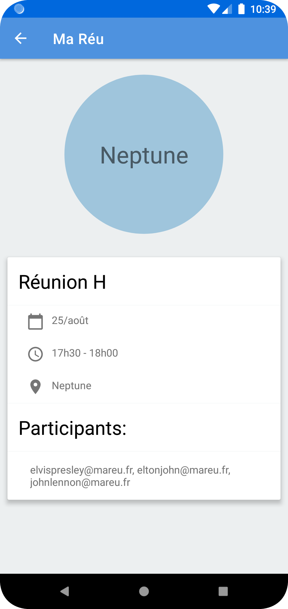

# MeReu

## About
This is my fourth project for Openclassrooms' **Android App Development program**.
This **Native Android App "MaReu"** is meant for managing meetings for better productivity and coordination.

## Testing
This source code package incorporates **unit tests** and **instrumentation tests** as well as **HTML results** of these tests.

## Installation
Clone/Download this repository and open it with **Android Studio**
```bash
git clone https://github.com/SimoJOUDAR/P4_MaReu.git
```

## Run the App
Once the project opened, you can run the App using Android studio's AVD to execute it.

## Generating signed APK
From Android Studio:
1. Go to ***Build*** menu
2. Go to ***Build Bundle(s) / APK(s)***
3. Click on ***Build APK(s)***
   The APK generated can be loaded and run on any Android phone.

## Preview
  

